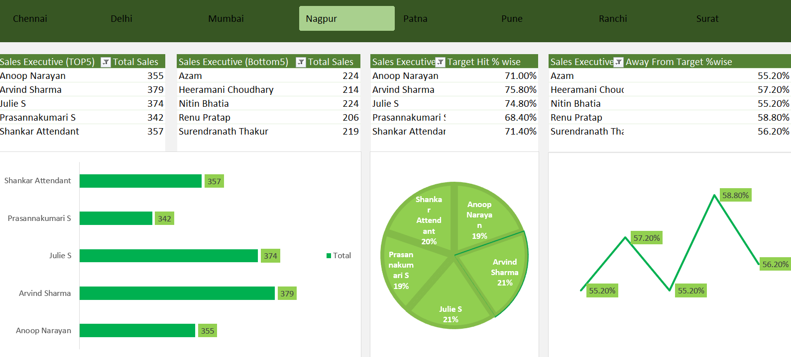

# Excel Sales Dashboard Project

This is a basic interactive sales performance dashboard created using **Microsoft Excel**. The project focuses on analyzing sales data across different cities and visualizing the performance of sales executives.

---

## 🔹 Key Features

- **Top 5 and Bottom 5 Sales Executives** by Total Sales  
- **Target Hit %** and **Target Away %** for top performers  
- **Dynamic filtering** with city-based slicers:
  - Chennai, Delhi, Mumbai, Nagpur, Patna, Pune, Ranchi, Surat  
- **Interactive Dashboard** built using Excel Pivot Tables and Charts

---

## 📈 Visualizations Used

- **Bar Chart** for total sales comparison  
- **Pie Chart** for target hit distribution  
- **Line Graph** for target away trend  

---

## 🛠 Tools Used

- Microsoft Excel  
- Pivot Tables  
- Slicers  
- Bar, Pie, and Line Charts  

---

## 📷 Dashboard Preview

---

## 💬 About the Project

This project was created to improve my skills in **Excel, data analysis, and dashboard design**. It helped me understand how to clean data, extract meaningful insights, and present them in a clear, visual format.

I’m open to feedback and suggestions — feel free to explore and connect!

---

## 🔗 Connect with Me

- [LinkedIn Profile](https://www.linkedin.com/in/azharsayedd/)
- [Project Demo on LinkedIn](https://www.linkedin.com/posts/azharsayedd_exceldashboard-dataanalysis-excel-activity-7347291512323395584-BO9j?utm_source=share&utm_medium=member_desktop&rcm=ACoAADldFecBTJ4KDucS_0PxJKGKworwVezot4Q) 

---

#️⃣ Tags:  
`#ExcelDashboard` `#DataAnalytics` `#Excel` `#DashboardDesign` `#SalesInsights` `#LearningByDoing` `#DataVisualization`
